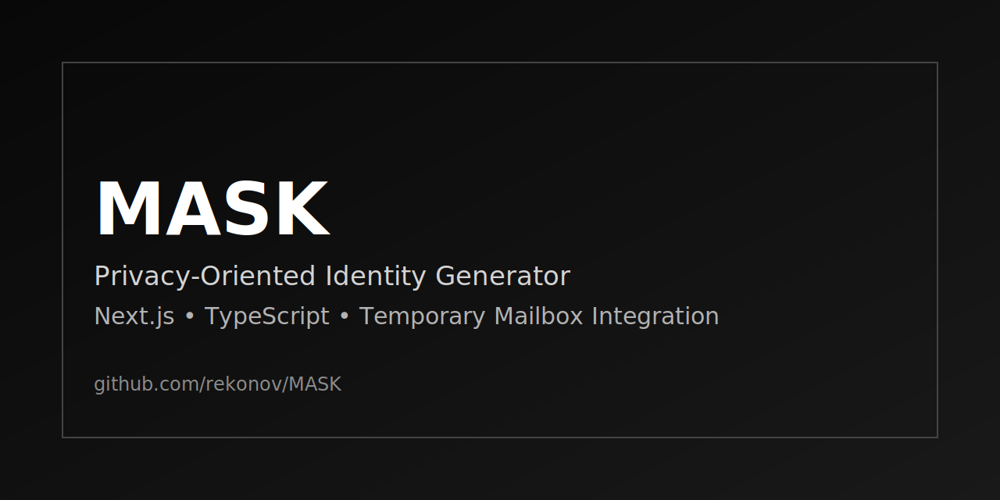

# MASK



[](#)
[](#)
[](#)

## Overview

MASK is a privacy-oriented identity generator.
It creates realistic test identities locally and supports temporary mailbox activation through `mail.tm`.

Main capabilities:
- Random profile generation (name, username, phone, address, birth date, email)
- Deterministic geometric avatar generation (client-side canvas)
- Live temporary inbox with periodic refresh
- Local-first behavior (no project database, no account system)

## Tech Stack

- Next.js 16 (App Router)
- React 19
- TypeScript 5
- Tailwind CSS 4
- `mail.tm` API via Next.js proxy route

## Quick Start

```bash
npm install
npm run dev
```

Open: `http://localhost:3000`

## Key Files

- `src/lib/generator.ts` - identity data generation
- `src/lib/avatar.ts` - deterministic avatar rendering
- `src/lib/tempmail.ts` - mailbox API integration
- `src/app/api/mail/route.ts` - server-side proxy for mail endpoints
- `src/components/IdentityCard.tsx` - main interaction UI
- `src/components/Inbox.tsx` - incoming messages view

## Status

- Stage: MVP
- Focus: UX polish and reliability improvements

## License

MIT
